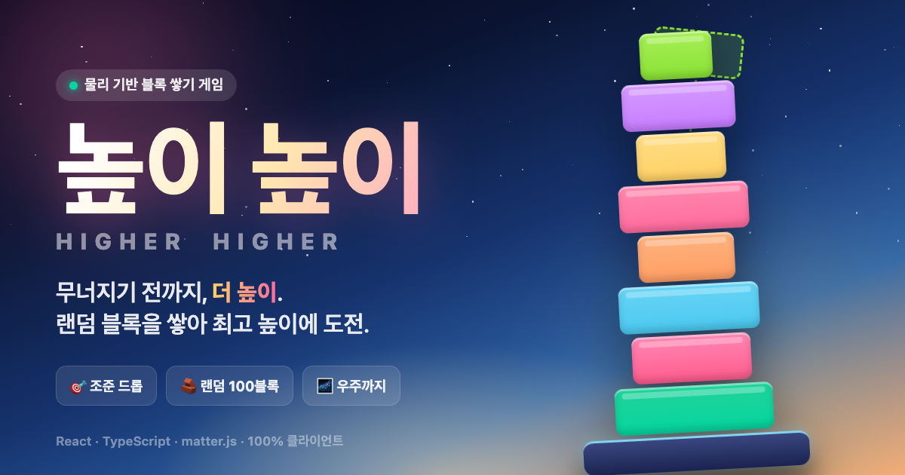
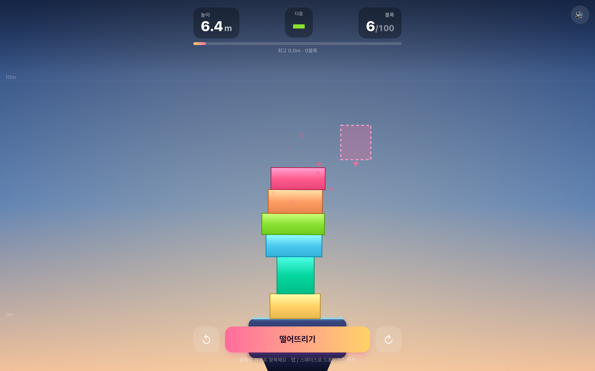

# 높이 높이 · Higher Higher



> **무너지기 전까지, 더 높이.** 랜덤 블록을 하나씩 위로 쌓아 최고 높이 기록에 도전하는 물리 기반 밸런스 게임. 균형을 못 잡으면 탑이 실제로 기울다 **와르르** 무너집니다.


## 🔗 라이브 데모

### ▶️ **https://higher-higher-lac.vercel.app**

## 🎮 게임 소개

- 다음 블록이 탑 꼭대기 위에서 **좌우로 자동 왕복**합니다. 크레인처럼 진자 운동으로 움직이죠.
- **탭 / 클릭 / 스페이스**를 누른 순간의 가로 위치에 블록이 **드롭**되어 낙하·안착합니다. 순수 **타이밍 게임**!
- 떨어진 블록은 **2D 강체 물리 엔진(matter.js)** 으로 실제 중력·마찰·회전(토크)에 따라 낙하·안착합니다.
- **잘 맞춰(중앙에) 놓으면 흔들림 없이 단단하게**, **치우치게 놓으면 기울다가** 균형을 잃고 무너집니다. 무너지면 게임 종료!
- 블록은 **최대 100개**. 무너지지 않고 100개를 다 쌓으면 **완주(클리어)** 입니다.
- 왕복 속도는 초반엔 느긋하다가 **높이 올라갈수록 조금씩 빨라져** 난이도가 올라갑니다.
- 높이 올라갈수록 배경 하늘이 **새벽 → 한낮 → 성층권 → 우주**로 변합니다. 🌌

## ✨ 주요 기능

- 🎯 **자동 왕복 + 클릭 드롭** — 블록이 스스로 좌우로 스윙, 탭 한 번으로 그 순간 위치에 투하. 데스크톱·모바일 동일.
- 🔮 **다음 블록 미리보기** — HUD의 **「다음」** 칸에 바로 다음에 나올 블록의 **모양 + 색**을 미리 보여줘 전략을 세울 수 있습니다.
- 🧱 **다양한 랜덤 블록** — 정사각·직사각·와이드·사다리꼴·L자·T자·다각형·반원·원. 굴러가기 쉬운 모양은 뒤로 갈수록 등장해 긴장감을 더합니다.
- ⚖️ **진짜 물리 밸런스** — 커스텀 캔버스 렌더링 + 고정 timestep 물리 시뮬레이션. 반발 0·높은 마찰·슬리핑 튜닝으로 **잘 놓으면 미동도 없이 단단**, 치우치면 여지없이 토플.
- 📈 **높이·블록 수 HUD** — 실시간 높이(m), 진행도(/100), 흔들림 경고. 탑이 자라면 카메라가 위로 따라 올라갑니다.
- 🏆 **최고 기록 저장** — `localStorage`에 최고 높이/블록 수 기록. 게임오버·완주 시 **결과 스코어 카드**(탑 스냅샷 이미지) 저장/공유.
- 🔊 **효과음 & 파티클** — Web Audio 기반 사운드, 안착 스파클, 붕괴 흔들림, 완주 컨페티.

## 🕹️ 조작법

| 입력 | 동작 |
| --- | --- |
| 탭 / 클릭 / `Space` / `Enter` | 왕복 중인 블록을 그 자리에 드롭 |
| `↺` `↻` / `Q` `E` / `↑` | 회전 |

## 🛠️ 기술 스택

- **React 19 + TypeScript** — UI / 상태
- **Vite 8** — 번들러 · 개발 서버
- **Tailwind CSS v4** — 다크 테마 UI
- **matter.js** — 2D 강체 물리(중력·충돌·마찰·토크). 렌더링은 물리 세계와 분리한 **커스텀 Canvas 2D**
- 서버·API 키 없이 **100% 클라이언트**에서 동작하는 정적 배포

## 🧪 검증

게임 상태 로직(블록 생성/난수, 자동 왕복 스윙 수식, 높이·점수 계산, 100개 제한, 무너짐 판정, 삼각형 제거)은 순수 함수로 분리해 자동 테스트합니다.

```bash
npm test   # 순수 로직 42개 단언 (tsx)
```

물리 플레이는 Playwright로 실제 구동을 확인했습니다 — 입력 없이도 블록이 좌우로 왕복하고, 탭한 순간의 위치에 안착하며, 다음 미리보기가 실제 다음 블록과 일치하고, 셰이프 풀에서 삼각형은 절대 나오지 않습니다. 또 **중앙 정렬로 쌓은 탑은 몇 초를 기다려도 거의 흔들리지 않고**(위치·각도 drift 극소), 일부러 치우치게 쌓으면 여전히 기울다 게임오버로 이어집니다.

## 🚀 로컬 실행

```bash
npm install
npm run dev      # 개발 서버
npm run build    # 타입체크 + 프로덕션 빌드
npm run preview  # 빌드 미리보기
```

## 📸 스크린샷



---

작게 시작해 우주까지. 당신의 기록은 몇 미터인가요? 🚀
